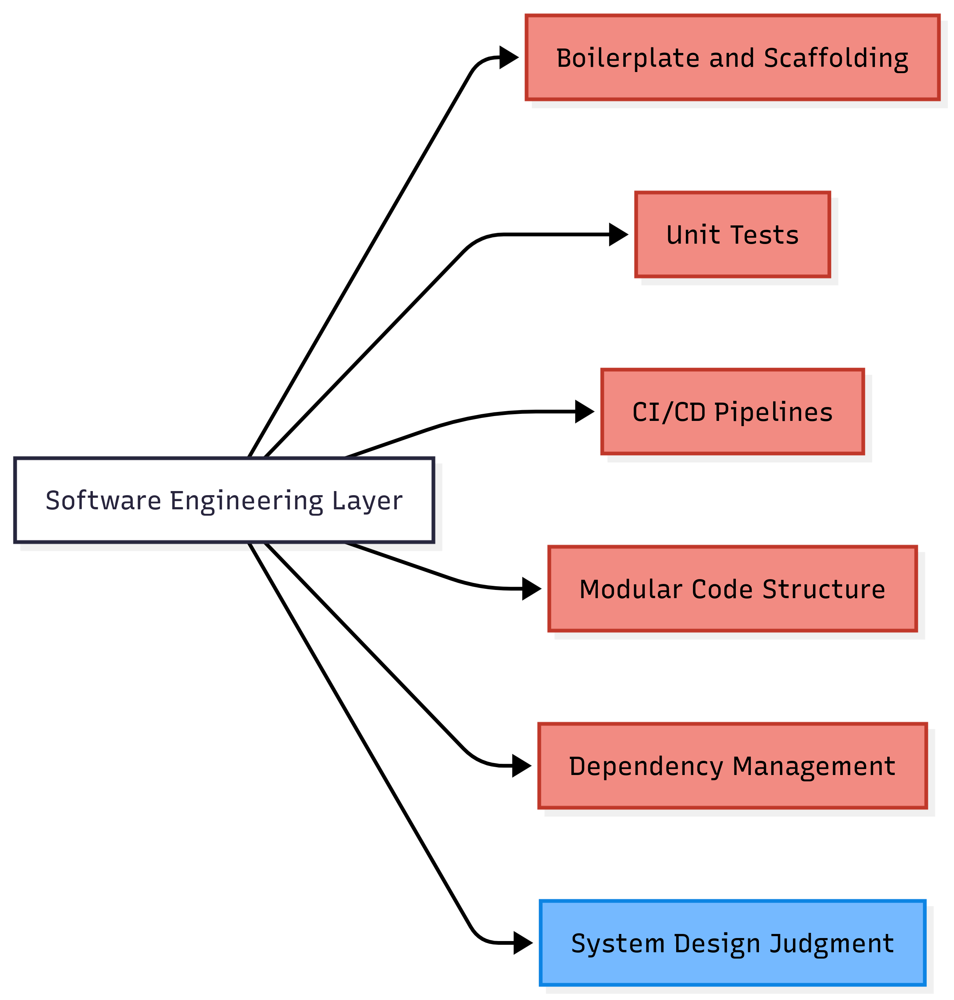
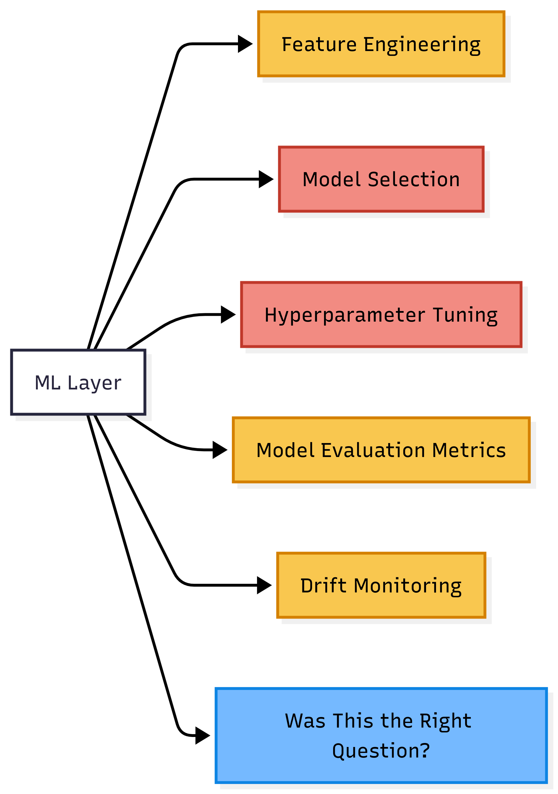
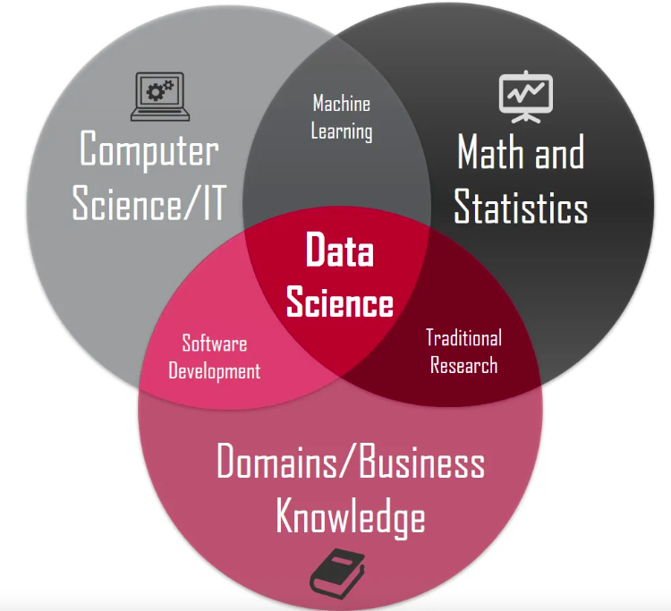
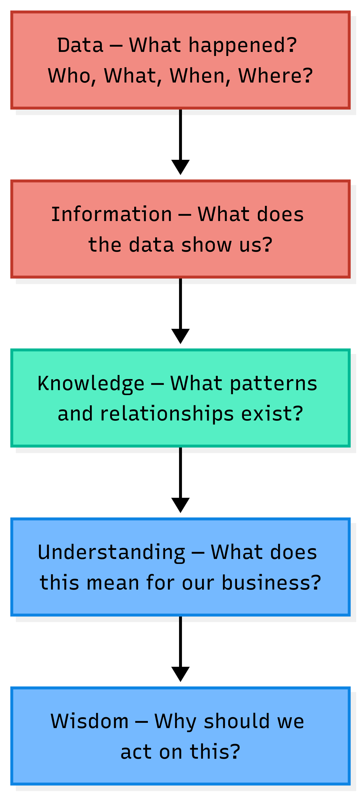
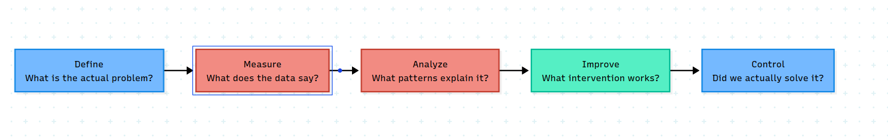

Something is changing. Not just the tools. The entire job description of a data scientist is being quietly rewritten.

Let us look at what is going away, what is staying, and honestly, what we should have been doing all along.

## The Code Is Getting Automated

A few years ago, writing a proper modular Python project needed real software engineering discipline. A clean `src/` folder, CI/CD pipelines, experiment tracking, versioned model artifacts. It took months to learn. More months to practice.

Today, the same project can be produced in a weekend with just three prompts. { This is not speculation. It has been done. My personal project. Look at the video below. }



The numbers back this up. GitHub Copilot alone now generates **46% of all code** written by its users. { Up from 27% at launch in 2022. Source: [GitHub Statistics, 2025](https://www.quantumrun.com/consulting/github-copilot-statistics/) } Developers using AI tools complete coding tasks **55% faster** on average. { Research across 4,800 developers by GitHub and Accenture. Source: [Second Talent, 2026](https://www.secondtalent.com/resources/github-copilot-statistics/) } And as of 2025, **41% of all code worldwide is AI-generated or AI-assisted**. { Source: [Second Talent, 2026](https://www.secondtalent.com/resources/ai-coding-assistant-statistics/) }

This is not a future prediction. This is today.

{fig-align="center" width="411"}

Red gets automated. Blue stays human. The judgment of what to build and why; that still needs a person.

## The Model Is Getting Automated Too

If code automation was the first wave, ML automation is the second.

AutoML platforms like Vertex AI, SageMaker Autopilot, and H2O Driverless AI take a CSV, try multiple algorithms, tune hyperparameters, and return a ranked leaderboard. Feature engineering assistance, SHAP explanations, and drift monitoring dashboards are all available out of the box.

{fig-align="center" width="364"}

Red is largely automated. Yellow is partially automated and moving fast. Blue remains human.

That last blue box is the most important one in the entire chart. No tool answers it.

## Data Science Is a Confluence of Three Worlds

Before we ask what is left, we need to understand what data science actually is. It sits at the intersection of three worlds.

{fig-align="center" width="405"}

Business and Mathematics together is **Traditional Research**. Think Supply Chain Analytics, Operations Research, simulation and modelling. This is the "lay of the land" layer. { I wrote about this earlier in my [domain knowledge post](https://arunkoundinya.github.io/AIBasicswithAK/blogs/posts/is-domain-knowledge-important/) }

Mathematics and Technology together is **Machine Learning**. Algorithms, statistical learning, model training.

Business and Technology together is **Software Engineering**. Building systems that actually work in the real world.

Data Science sits at the center where all three meet.

Here is the honest observation. AI is eating the Machine Learning automation and Software Engineering automation. What it is not eating is the Business layer, and the Traditional Research that connects to it.

## What Is Traditional Research in Non-Tech Companies?

In non-tech companies, Traditional Research does not mean academic journals. It means understanding the real problem before opening a laptop.

In **Supply Chain Analytics**, it means knowing safety stock formulas, reorder levels, service levels, and the bullwhip effect before writing a single line of forecasting code.

In **HR Analytics**, it means understanding attrition drivers, compensation bands, and what management actually decides on before building a retention model.

In **Operations Analytics**, it means knowing process flow, bottleneck theory, and cost per unit before running an optimization.

In **Customer Analytics**, it means understanding the Customer Lifecycle, the difference between retention and win-back, and what "loyalty" actually means for that specific business.

In **Marketing Analytics**, it means knowing media mix constraints, the seasonality of the business, and what a 1% lift in conversion actually translates to in revenue.

None of this knowledge comes from a dataset. It comes from curiosity, asking the right questions, and sometimes just sitting with a business head long enough to understand how they think.

This is the layer AI cannot replace. Not because AI lacks computation power. But because this layer requires **knowing the problem before you define the data.**

## So What Is Left? The DIKW Answer.

The DIKW pyramid { Data, Information, Knowledge, Wisdom } has been in information science literature since the 1980s. It is simple. And it maps precisely onto what is happening today.

{fig-align="center" width="181"}

Red is AI's territory today. Green is contested and AI is moving into it quickly. Blue is where humans own the outcome.

Most data science teams today operate in red. They hand the output to a business head who needs blue. The gap in between is not a tools problem. It is a translation problem.

The person who can translate is the most valuable person in the room.

## The Consulting Layer: Where DMAIC Lives

That translation has a name. And it is older than most data scientists realize.

**DMAIC. Define. Measure. Analyze. Improve. Control.**

Six Sigma was developed by Bill Smith at Motorola in 1986 to reduce manufacturing defects through statistical discipline. { Source: [Six Sigma History, sixsigmaonline.org](https://www.sixsigmaonline.org/six-sigma-history/) } By the late 1990s, nearly two thirds of Fortune 500 companies were running Six Sigma programs. The DMAIC framework was its core contribution: a disciplined, repeatable way to move from a business problem to a proven, measurable solution.



AI handles Measure and Analyze well. Improve is shared. But **Define and Control** remain human.

Data scientists jumped straight to Measure and Analyze. They assumed someone else had already framed the problem correctly. Often nobody had.

That is precisely why business leaders say "there are no actionable insights from the team." The team answered a question the business was not asking.

SMART goal framing, process mapping, scope definition, root cause thinking. These were dismissed as old-fashioned consulting tools not worthy of a data scientist's attention. They are the Define phase. And the Define phase is what makes everything else matter.

## Data Science Quietly Killed Business Analytics

Let me tell you a story that starts in 2007.

North Carolina State University launched the **nation's first Master of Science in Analytics** that year. { Source: [NC State Institute for Advanced Analytics](https://analytics.ncsu.edu/) } The program was not called data science. It was not called machine learning. It was deliberately called Analytics, because the intent was different. The curriculum mixed applied mathematics, statistics, computer science, and crucially, **business disciplines**. Students worked on real problems with data provided by industry sponsors. The goal was to produce professionals who could bridge both worlds.

That was the signal the market was sending in 2007. Business needed people who understood data *and* decisions. Not just one of them.

What followed was a wave of similar programs across the world. Business schools and executive education programs started building structured analytics curricula for working professionals. The Indian School of Business launched its Certificate Programme in Business Analytics for experienced executives ***( I belong to the second batch of ISB CBA and was in Dean's list at that point of time in 2015)***. Programs like these taught a specific discipline i.e.; how to move from a messy business problem to a solvable quantitative question. DMAIC thinking, statistical process control, Operations Research, decision theory. The kind of thinking that asks "what is the actual problem" before touching any data.

Then October 2012 arrived.

Thomas Davenport and DJ Patil published **"Data Scientist: The Sexiest Job of the 21st Century"** in Harvard Business Review. { [HBR Vol. 90, No. 10, October 2012, pp. 70-76](https://hbr.org/2012/10/data-scientist-the-sexiest-job-of-the-21st-century) } The article was not wrong. It described a genuine and important shift. But it had an unintended side effect on how the market hired, trained, and rewarded analytical talent.

What followed was a decade of Kaggle competitions as credentials, GitHub repositories as resumes, and Python fluency as the primary interview signal. Data science job postings on Indeed tripled between 2013 and 2020. { Source: [Domino Data Lab, 2020](https://domino.ai/blog/data-scientist-still-the-sexiest-job-of-the-21st-century) } Universities raced to rename analytics programs as data science programs. The curriculum shifted toward modelling, deep learning, and technical sophistication.

What got quietly deprioritized was the structured problem formulation that Business Analytics programs had been carefully building since 2007.

In 2022, Davenport and Patil revisited their own 2012 article. They acknowledged that the importance of **non-technical expertise** had grown significantly in the decade since. { Source: [Davenport & Patil, HBR, July 2022](https://hbr.org/2022/07/is-data-scientist-still-the-sexiest-job-of-the-21st-century) } In other words, the authors who helped start this shift were themselves saying something was missing.

To be honest, "data science killed business analytics" is a directional observation, not a proven causal fact. Business Analytics programs still exist. ISB still runs its programme. What changed is what organizations rewarded in hiring. A model with a good AUC was visible and measurable. A well-scoped problem definition was not.

The loss was quiet. And large. And most data scientists do not even know it happened, because they werenever taught what was lost.

## What Technical Skills Are Still Needed?

Technical skills still matter. Just fewer of them, and different ones.

**Python and SQL** remain foundational. R, SAS, and SAP are declining in job postings. { Source: [StrataScratch, 2024](https://www.stratascratch.com/blog/data-science-in-2024-what-has-changed/) } This is observable in the market today and is not disputed.

**Cloud infrastructure** matters for organizations with real data volumes. Snowflake, Databricks, and the major cloud providers are not going away. Data pipelines and governance remain a human responsibility even as execution gets more automated.

**Git and version control** remain foundational. AI generates code. Git manages what happens to it. Without it, reproducibility is a promise nobody can keep.

**Prompting and LLM fluency** is the new entry-level skill on the left side. Not prompt engineering as a formal specialty. But the ability to articulate a problem clearly to an AI tool and evaluate its output with judgment. This is becoming as fundamental as knowing how to write a SQL query.

What organizations will actually invest in going forward is simpler than most platform vendors want to admit: **clean data infrastructure, Git discipline, and AI API access.** The expensive platforms in the middle are under pressure from exactly this combination.

{ To be fair: this is a directional argument. Platform vendors will adapt. But cost-benefit pressure is real and growing. }

## Going Forward: Data Science as Kaizen

Kaizen is a Japanese concept. It means continuous small improvement. Not a big transformation program. Not a moonshot. Small, disciplined, honest steps forward, one problem at a time.

This is what data science should look like in an AI world.

Not chasing the latest model architecture. Not proving technical sophistication. Not adopting the most expensive platform.

Understanding the current state of a real business process. Defining clearly what better looks like. Measuring the change honestly. Improving one thing. Controlling the result. Then the next problem.

The business analytics curriculum that many data scientists dismissed as not rigorous enough contains exactly this thinking. Statistical process control, process capability analysis, structured root cause thinking. Not old-fashioned. Underused.

The data scientists who thrive going forward will not be the ones who mastered the most tools. The tools will keep changing. They always do.

They will be the ones who can sit across from a business head, understand what is genuinely uncertain for that person, and bring the right analysis to reduce that uncertainty. With humility. One domain at a time.

**The parallel lines never meet until there is a gentle nudge.**

Going forward, that gentle nudge is not a better algorithm. It is a better question.

```{=html}
<script src="https://giscus.app/client.js"
        data-repo="ArunKoundinya/AIBasicswithAK"
        data-repo-id="R_kgDOLXPVRw"
        data-category="General"
        data-category-id="DIC_kwDOLXPVR84CdeVx"
        data-mapping="pathname"
        data-strict="0"
        data-reactions-enabled="1"
        data-emit-metadata="0"
        data-input-position="bottom"
        data-theme="purple_dark"
        data-lang="en"
        crossorigin="anonymous"
        async>
</script>
```